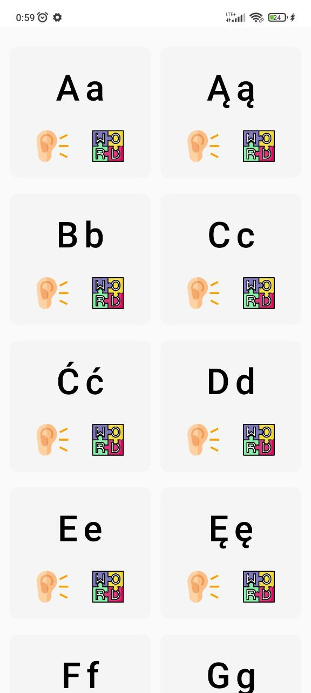
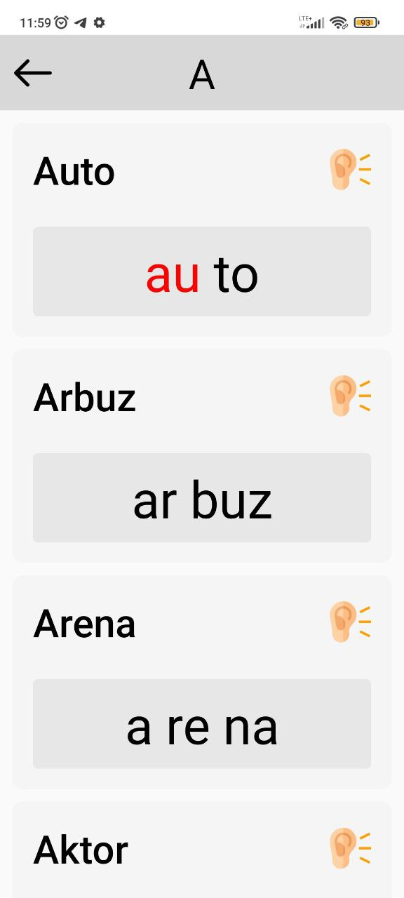
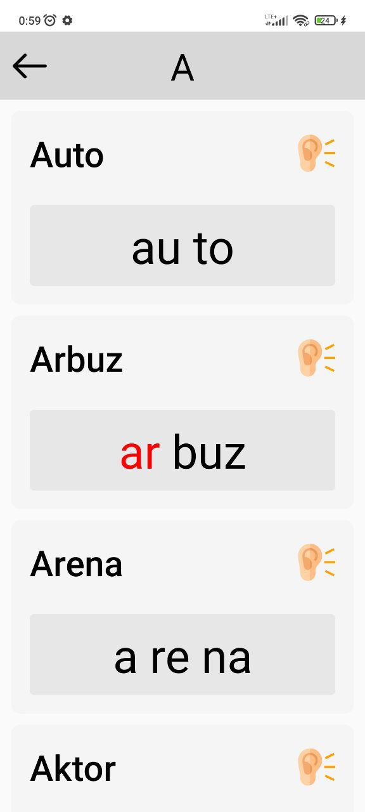

# Learn reading

React Native app for my little sister to learn polish alphabet using Expo, TTS engine and React navigation
 
 
[Install on Android](https://drive.google.com/file/d/1A3cmMMPkz4_X5JCkyGeRjxqXQIi4xttf/view?usp=sharing)

## Demo:

## More screens:

